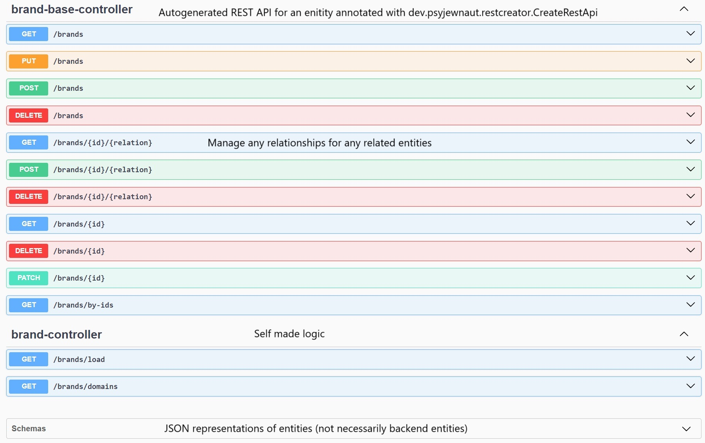

# RestCreator — библиотека автогенерации эффективного REST API

RestCreator предоставляет механизм генерации REST API из ORM и избавляет от необходимости реализовывать наиболее известные операции. Позволяет в один клик создавать приложения с гибким и высокопроизводительным REST-интерфейсом и всей необходимой документацией. При этом весь код остается доступным для кастомизации и поддержки.<br>
Отлично подходит для микросервисов и при дефиците ресурсов.

## Ключевые преимущества

- **Автоматизация** — генерация всех необходимых слоев: контроллеры, сервисы, репозитории и обёртки ответов.
- **Гибкость** — разработчик может вмешаться и донастроить любую часть сгенерированного кода.
- **Высокая производительность** — за счет оптимизированной логики и структуры слоев.
- **Экономия времени** — решение исключает работу по написанию известных решений CRUD операций.
- **Надежность** — минимизация человеческого фактора за счет автогенерации и унифицированной кодовой базы.
- **Документация** — javadoc, OpenAPI спецификация и Swagger UI.

## Требования

- Spring Boot 3 с Hibernate

## Установка

Для установки необходимо просто добавить зависимость в проект:

```
<dependency>
    <groupId>dev.psyjewnaut</groupId>
    <artifactId>rest-creator</artifactId>
    <version>1.0.0</version>
</dependency>
```

## Пример использования

Желаемую сущность нужно просто пометить желаемыми аннотациями `@CreateRestApi` (содержит все 3 следующих аннотации), `@CreateService`, `@CreateRestController`, `@CreateRepository`

```
import dev.psyjewnaut.restcreator.annotations.CreateRestApi;
//...
@CreateRestApi
@Entity
public class Brand {
    @Id
    @GeneratedValue
    private Long id;
    private String name;
    // ...
}
```

После этого современные среды разработки распознают код будущих классов `BrandBaseRepository`, `BrandBaseService`, `BrandBaseController` для сущности `Brand` и они будут готовы для кастомизации:

```
import dev.psyjewnaut.restcreator.models.RestResponse;
//...
@Primary
public class BrandController extends BrandBaseController {

    @GetMapping("/load")
    public class loadBrand(HttpServlerRequest request, @RequestParam String id){
        return new RestResponse.ok(request).body(brandBaseService.getById(id))
    }
    //...
}
```

## Результат

При запуске приложения вы получите готовый REST API с open-api.json и Swagger UI:
<br>


## Возможные конфликты
Библиотека использует стандартные бины Jakson и Hibernate, включая официальные модули Hibernate со стандартной настройкой, поставляемые автоконфигурацией Spring Boot.<br>
При глобальном переопределении логики сериализации Jakson и ленивой инициализации Hibernate в вашем приложении, необходимо учитывать возможные конфликты.

## License
На данный момент не распространяется публично.<br>
Email для предложений: psyjewnaut@gmail.com
